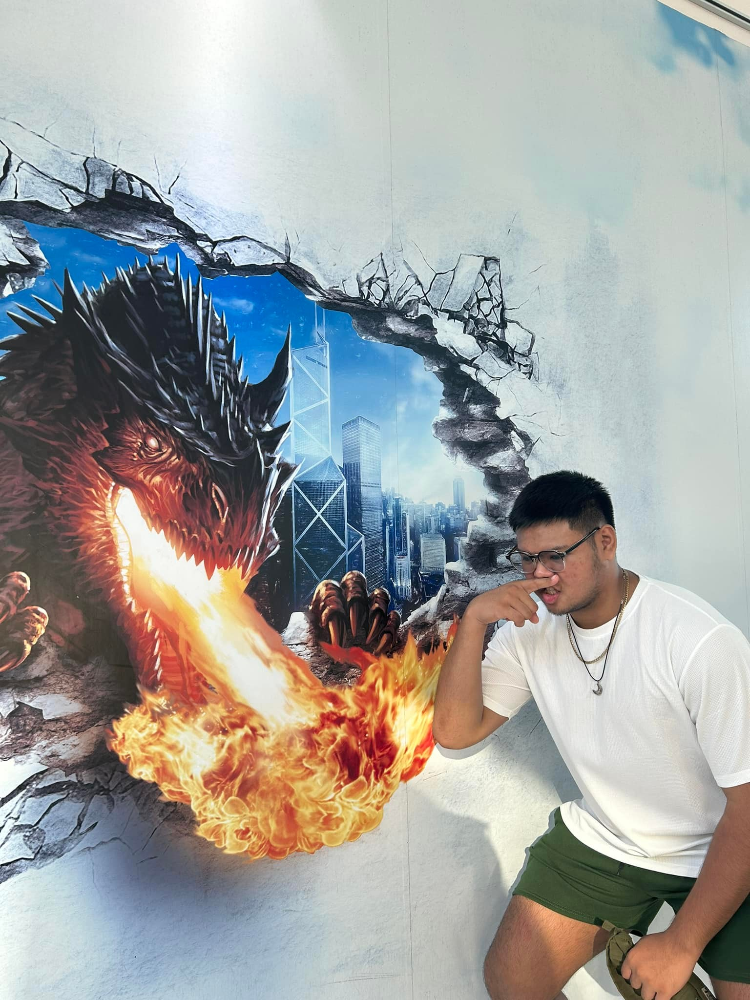

<a name="readme-top"></a>

<br/>

<div align="center">
  <a href="https://github.com/clarkllamoso/">
    
  </a>
  <h3 align="center">My Online Portfolio</h3>
</div>

<div align="center">
  A personal website showcasing my skills, education, projects, and goals as a future cybersecurity professional.
</div>

<br/>


---

<details>
  <summary>Table of Contents</summary>
  <ol>
    <li><a href="#overview">Overview</a></li>
    <li>
      <a href="#key-components">Key Components</a>
      <ol>
        <li><a href="#technology">Technology</a></li>
      </ol>
    </li>
    <li><a href="#rules-practices-and-principles">Rules, Practices and Principles</a></li>
    <li><a href="#resources">Resources</a></li>
    <li><a href="#file-structure">File Structure</a></li>
  </ol>
</details>

---

## 🧠 Overview

This project is a responsive multimedia portfolio website made for my final project in Web Design. It showcases my academic background, technical projects, and personal information.

### 🎯 Guiding Questions

- **What is this project about?**  
  A personal portfolio website built using HTML, CSS, and a little JavaScript.

- **What is its purpose?**  
  To demonstrate front-end design skills and personal branding.

- **What are its key components?**  
  Landing page, About Me, Education, Projects, and Contact.

- **What technologies are used?**  
  HTML, CSS, JavaScript (for interactivity and animation)

---

## 🧩 Key Components

- Multi-page responsive layout  
- Background video on homepage  
- Contact and Projects sections  
- Modern design with animations  

### 💻 Technology


---

## 📏 Rules, Practices and Principles

1. Folder named `WD-Clark-Finals`  
2. Each page has its own folder with `index.html`  
3. Use camelCase for file naming (e.g. `clark1.jpg`)  
4. External CSS only — no inline styling  
5. Consistent spacing, font, and color palette  

---

## 📚 Resources

| Title             | Purpose                              | Link                                              |
|-------------------|--------------------------------------|---------------------------------------------------|
| Google Fonts      | Fonts: Montserrat, Roboto            | [https://fonts.google.com](https://fonts.google.com) |
| Font Awesome      | Icons used throughout the site       | [https://fontawesome.com](https://fontawesome.com) |
| GitHub Pages      | Hosting                              | [https://pages.github.com](https://pages.github.com) |
| Visit Counter     | Page visitor counter                 | [https://visit-counter.vercel.app](https://visit-counter.vercel.app) |

---


## 📁 File Structure

```
WD-Finals-Llamoso/              
├── assets/
│   ├── css/
│   │   └── style.css        
│   ├── img/
│   │   ├── clark1.jpg
│   │   ├── clark2.jpg
│   │   ├── clark3.jpg
│   │   ├── clark4.jpg
│   │   ├── clarkabout1.jpg
│   │   ├── clarkabout2.jpg
│   │   ├── clarkabout3.jpg
│   │   ├── clarkabout4.jpg
│   │   ├── clarkabout5.jpg
│   │   ├── clarkeducation1.jpg
│   │   ├── clarkeducation2.jpg
│   │   ├── clarkeducation3.jpg
│   │   └── clarkeducation4.jpg
│   └── js/
├── pages/
│   ├── page1/
│   │   └── index.html        
│   ├── page2/
│   │   └── index.html        
│   ├── page3/
│   │   └── index.html       
│   └── page4/
│       └── index.html        
├── index.html                 
└── README.md
```

